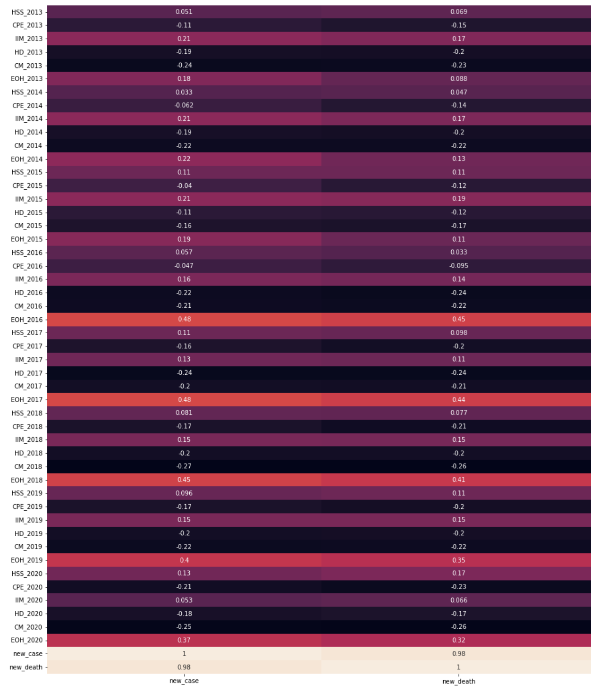
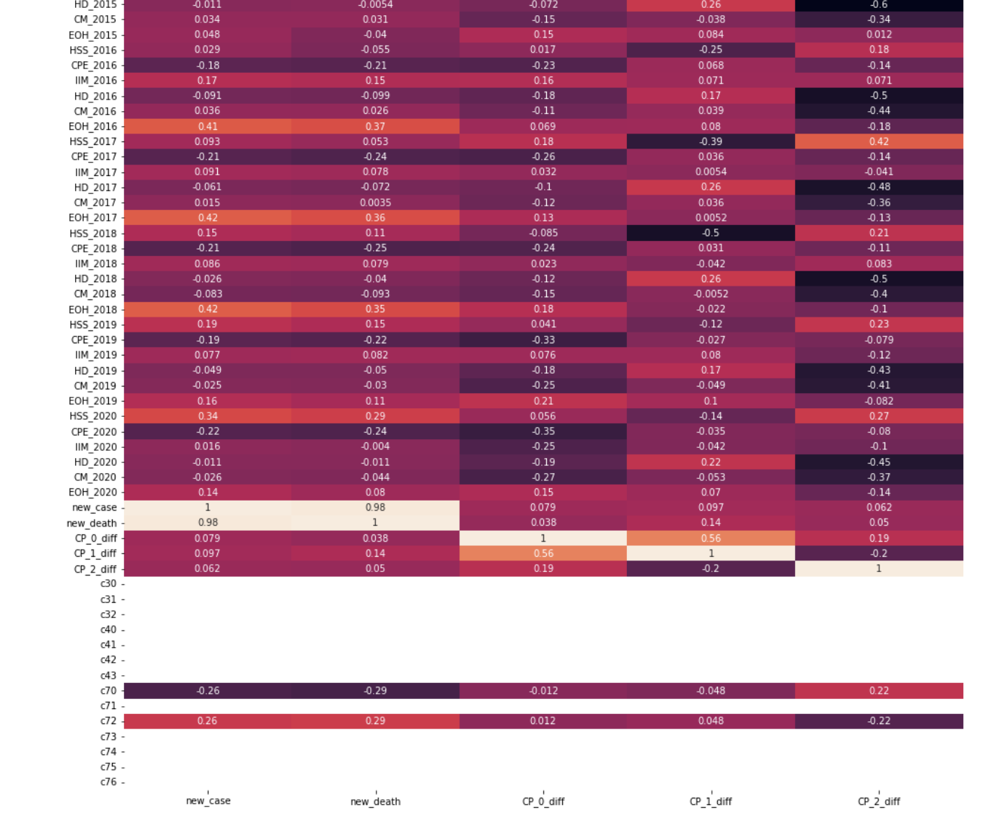
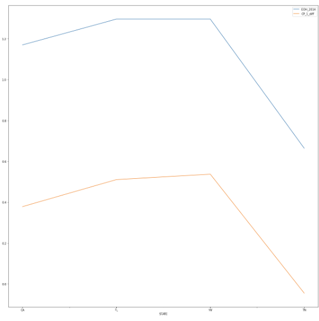

# NHSPI Index as a Covid Indicator 

# Introduction 

The NHSPI Index combines measures from multiple sources and perspectives to offer a broad view of the health protections in place for the nation as a whole and for each U.S. state. The Index identifies strengths as well as gaps in the protections needed to keep people safe and healthy in the face of large-scale public health threats, and it tracks how these protections vary across the United States and change over time.

This project is based around validating the efficacy of the metric, specifically for COVID as a national health emergency and aims to find correlations between the index and on-ground Covid numbers. 

# Findings  
1. The following correlation matrix was found when correlating the total deaths and total cases with different metrics from the index. 
    1. The correlation technique used is Pearson Correlation. 
    2. The domain as shown can be referred to from [NHSPI](https://nhspi.org/the-index/) . {EOH_2016 would mean Environmental Occupation and Health for 2016.}
    3. I found a correlation of 0.4-0.5 for the EOH metric which is medium-to-high. 

2. Furthermore, for a second experiment, I believed that the demographic would heavily affect the correlation as well. (The ideology behind this being that if a state has a good index score but older population, covid would disproportionately affect its numbers but the index might still be effective when comparing states of similar composition) 
     1. Used a clustering algorithm and census data parameters to find groups of states with similar composition(demographically speaking ) . 
     2. Setting 7 as the number of segments showed the most in-line results to hypothesis.
     1. Census parameters used for clustering : ('Total Population', 'Median Household Income', 'Bachelor's Degree or Higher', 'Employment Rate', 'Total Housing Units', 'Without Health Care Coverage', 'Total Employer Establishments', 'Total Households', 'Hispanic or Latino (of any race)') 
     2. On running the same correlation algorithm for the above groups of states as opposed to all of the states leading to 7 different correlation matrices. 
     3. What I found was that we had a few matrices with really high correlation and few with really low correlation. as hypothesised. 

3. This effect is exaggerated even more for smaller clusters, to the point where the correlation reaches 1 for some NHSPI domains. 

# Etc. 
Random personal project based around covid dataset public policy metrics. 